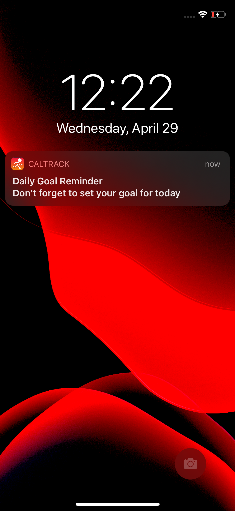
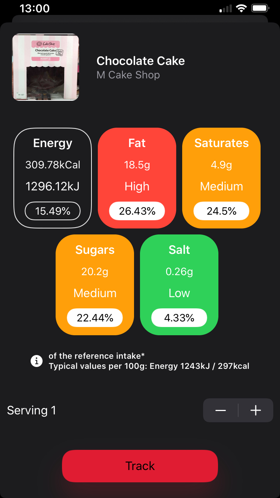
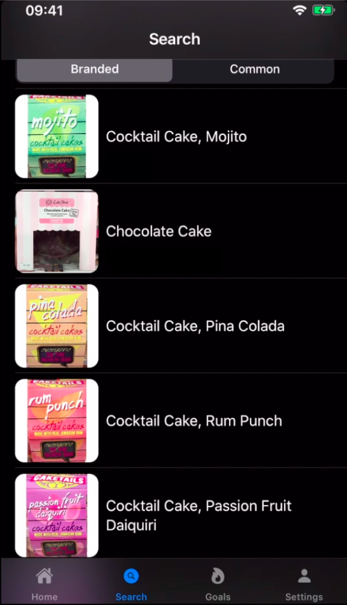
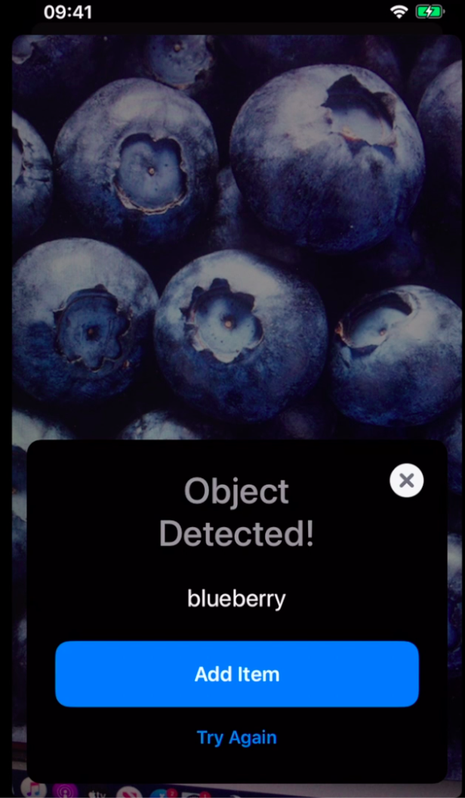
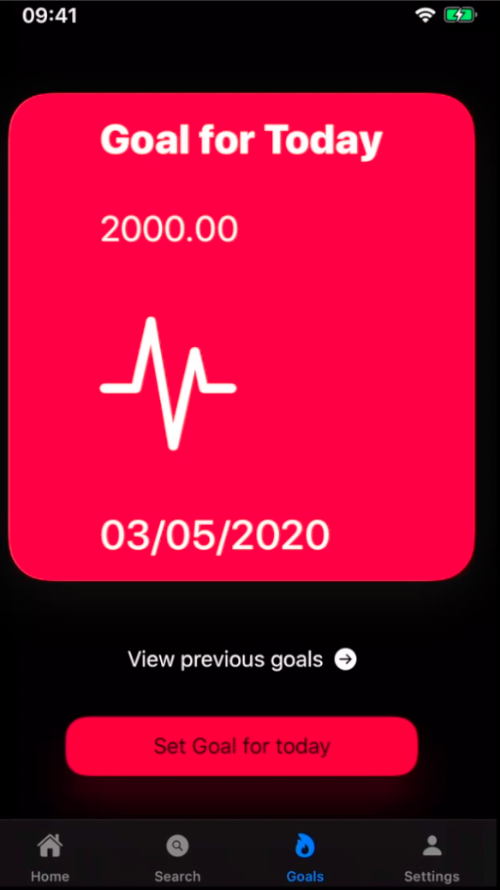

# CalTrack

An iOS app that let's you track your food calories

# Features #

* 3 different methods to track calories 
  * Search for the item 
  * Scan the Barcode
  * ML to detect common food items
  
* Set Daily Goals

* Integrate with HealthKit to get a overall calorific value for the day (Calories Burned vs Calorie Intake)

* Notification Reminder to set daily goals

* Account Creation/Management

* View previous goals

* Support for Light/Dark mode

# Screenshots #

# Demo #

